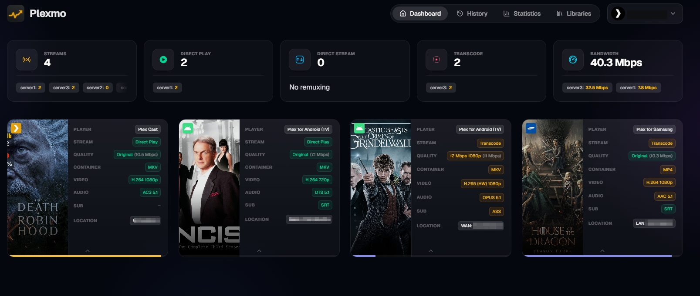
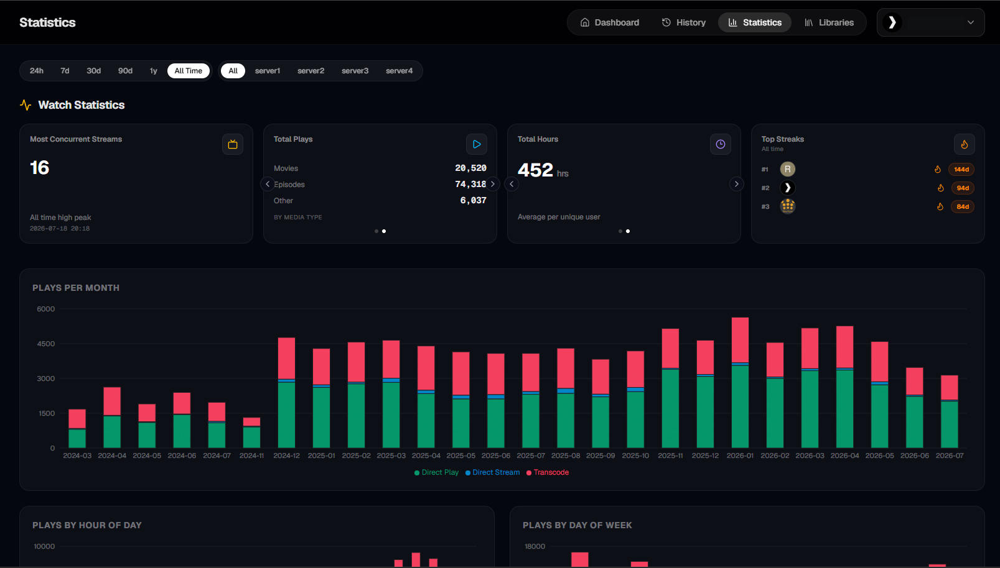
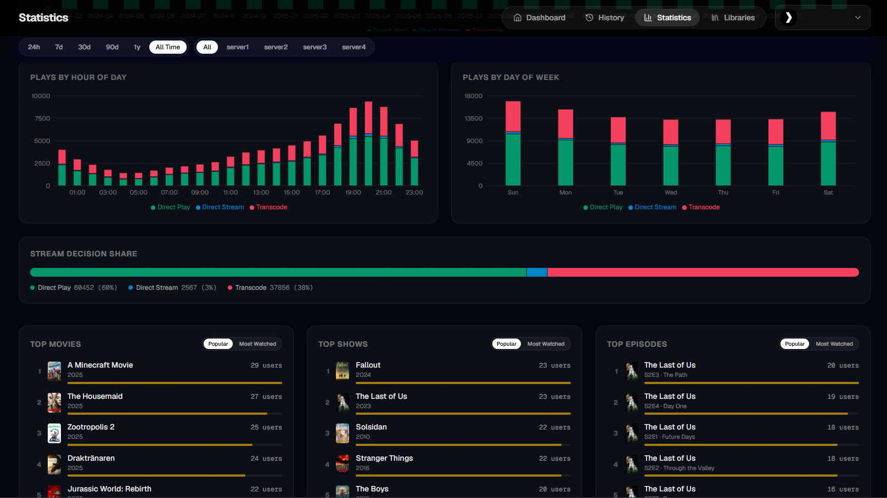
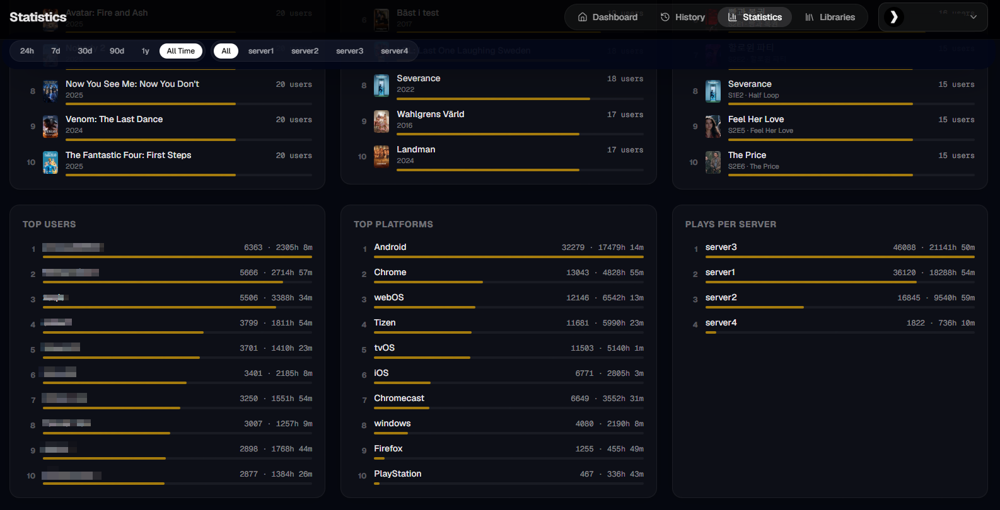
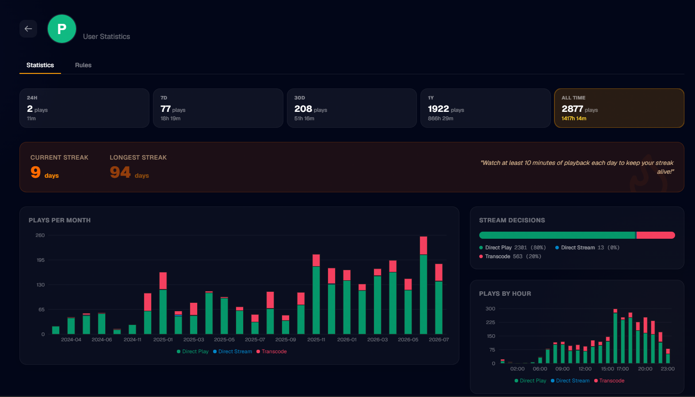
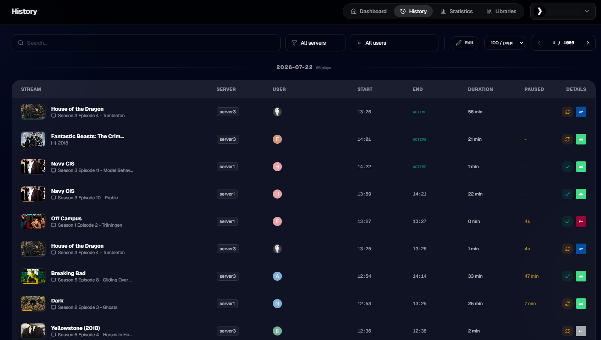
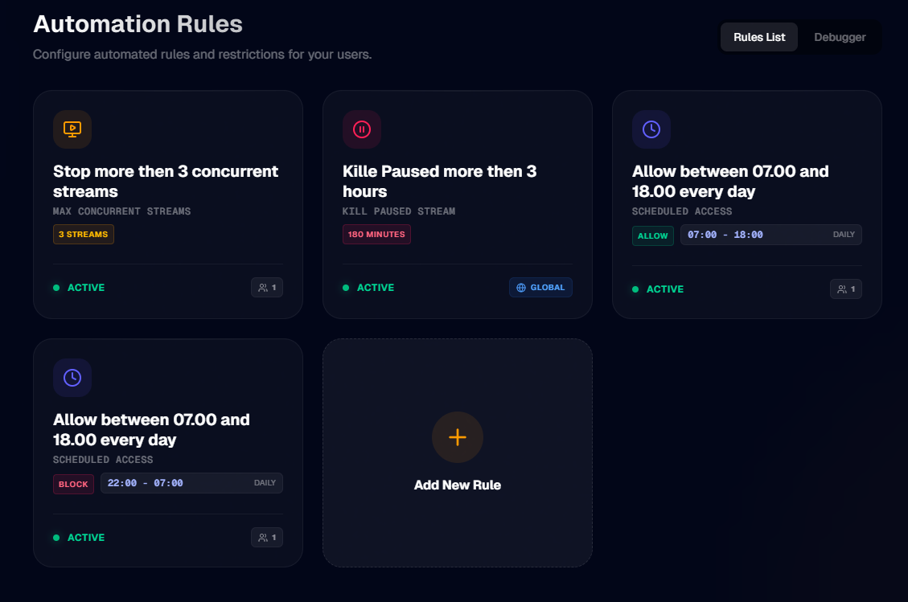

# Plexmo

[](https://github.com/thu3n/plexmo/blob/main/LICENSE)
[](https://github.com/thu3n/plexmo)

**A modern Plex dashboard that treats your servers as one.**

Plexmo is a free and open source monitoring and analytics dashboard for Plex - a modern alternative to Tautulli, built for people who run more than one server.

**Connect as many Plex servers as you want to a single Plexmo instance.** Users are identified by their Plex account, not by the server they happen to be streaming from, so someone who watches across three of your servers is one person in your stats - one watch history, one set of automation rules. No container per server, no exports to stitch together.

It runs as a single container with an embedded database: one volume to back up, no separate database or cache service to operate.



## Features

- **Unified Multi-Server View** - Every server in one dashboard, with per-server breakdowns whenever you want them. Add and remove servers without losing history
- **One Identity Per Person** - The same Plex account across several servers is merged into a single user, so watch time, streaks and rankings reflect the person rather than the server
- **Real-time Session Monitoring** - Live streams across all connected servers at once, with full playback and transcode detail
- **Advanced Statistics** - Watch history, user behavior, content trends, concurrent-stream peaks and viewing streaks
- **Automation Rules** - Concurrent stream limits and scheduled access windows, applied per user or globally, with optional auto-termination, a custom message to the viewer, and Discord alerts
- **Tautulli Import** - Bring your existing watch history with you, from the Tautulli API or straight from its database file
- **Discord Integration** - Push notifications and activity updates directly to your Discord server
- **Multi-admin Authentication** - Plex sign-in with invite links: hand someone a single-use link and they either join as a viewer or connect their own Plex server to your instance
- **Installs Like an App** - Progressive web app with its own icon, splash screen and name - add it to your phone's home screen and it opens standalone
- **Single Container** - One image, one volume, an embedded SQLite database, and a full backup you can download as a single file

<details>
<summary>📸 View Screenshots</summary>

### Statistics Dashboard




### User Statistics


### Watch History


### Automation Rules


</details>

## Roadmap

- **More Statistics** - Continuously expanding the analytics with new insights, rankings, and views
- **Per-title Statistics** - Browse into a library, open a specific movie or show, and see statistics tied to just that title
- **Advanced Notifications** - Enhanced Discord alerts with Email and Telegram support
- **Granular Exports** - Export watch history or settings independently
- **Scheduled Backups** - Automated backup scheduling
- **More Stream Control** - Expanded options for managing and controlling active streams
- **Overseerr Integration** - User request statistics and habits tracking

## Getting Started

Check out the documentation for detailed installation instructions.

**Docker (Recommended)**

```bash
docker pull ghcr.io/thu3n/plexmo:latest

docker run -d \
  --name plexmo \
  -p 3000:3000 \
  -v plexmo-data:/app/config \
  ghcr.io/thu3n/plexmo:latest
```

Or use Docker Compose:

```yaml
version: '3.8'
services:
  plexmo:
    image: ghcr.io/thu3n/plexmo:latest
    container_name: plexmo
    ports:
      - "3000:3000"
    volumes:
      - plexmo-data:/app/config
    restart: unless-stopped

volumes:
  plexmo-data:
```

**Manual Installation**

```bash
git clone https://github.com/thu3n/plexmo.git
cd plexmo

npm install
npm run build
npm start
```

Open [http://localhost:3000](http://localhost:3000) and complete the setup wizard to connect your Plex server.

## Inviting users

Instead of whitelisting email addresses, owners can generate one-time invite links under **Settings → Access**:

- **Full onboarding** - the invitee signs in with Plex and connects their own Plex server to your Plexmo instance.
- **Access only** - the invitee becomes a viewer on your servers (like the email whitelist, which still exists alongside).

Links are single-use with a mandatory expiry, and only a hash of the link secret is stored - copy the link when you create it, it is never shown again.

## Backup & Restore

**Settings → Import** offers a full backup download (`plexmo-backup-<date>.zip`: a consistent database snapshot, the session secret, and a manifest) and a restore upload that replaces all data and restarts Plexmo. A fresh instance can also restore during first-time setup ("or restore from a backup" on the sign-in step) - the complete path for moving Plexmo to a new machine.

Auto-restart after a restore relies on Docker's `restart: unless-stopped` policy (already in the compose file). Without Docker, restart the process manually when prompted. The backup contains Plex tokens and the API key in plain text - store it safely.

## Support

- Bug reports and feature requests can be submitted via [GitHub Issues](https://github.com/thu3n/plexmo/issues)
- Questions and discussions are welcome in [GitHub Discussions](https://github.com/thu3n/plexmo/discussions)
- Chat with the community on [Discord](https://discord.gg/4rvmVg8Ejt)

## Contributing

Plexmo is developed in the **vibe coded** philosophy - prioritizing aesthetic minimalism, intuitive UX, and efficient functionality. Contributions are welcome! Please feel free to submit pull requests or open issues for bugs and feature requests.

## License

Plexmo is licensed under the [MIT License](LICENSE).

---

**Note:** This project is developed independently and is not affiliated with Plex Inc.
